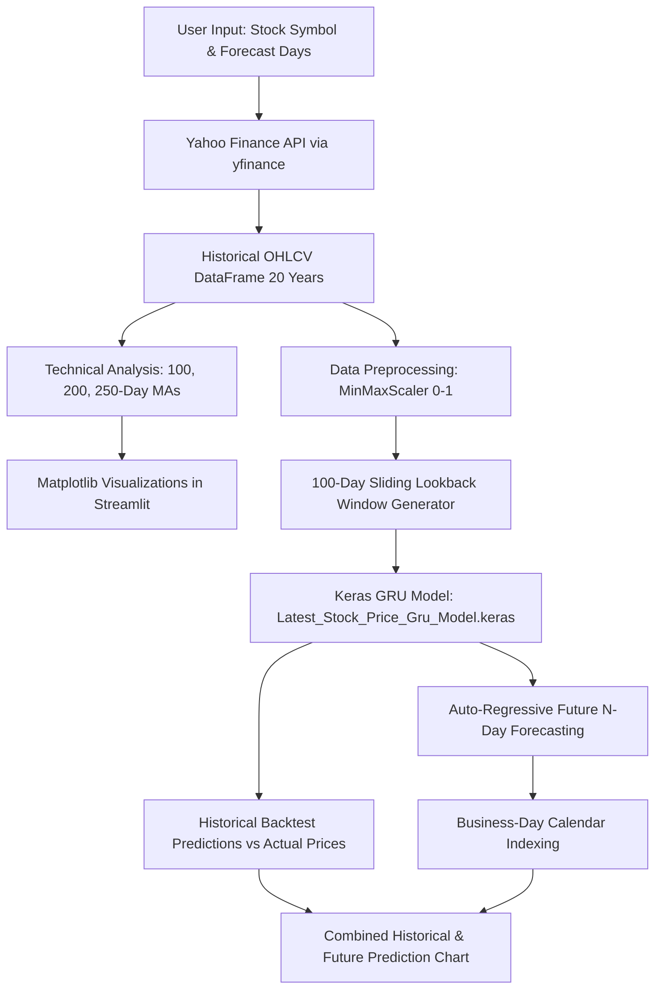

# 📈 Stock Price Predictor App

An interactive web application built with **Streamlit** and **Keras (TensorFlow)** for analyzing historical financial time series and forecasting stock prices using a **Gated Recurrent Unit (GRU)** deep learning model.

---

## 📌 Table of Contents

- [Overview](#overview)
- [Key Features](#key-features)
- [System Architecture & Workflow](#system-architecture--workflow)
- [Project Structure](#project-structure)
- [Prerequisites](#prerequisites)
- [Installation & Setup](#installation--setup)
- [Model Configuration](#model-configuration)
- [Usage Guide](#usage-guide)
- [How It Works (Methodology)](#how-it-works-methodology)
- [Roadmap & Enhancements](#roadmap--enhancements)
- [Disclaimer](#disclaimer)

---

## 🔍 Overview

The **Stock Price Predictor App** fetches up to 20 years of real-time and historical equity data directly from Yahoo Finance (`yfinance`). It calculates key technical momentum indicators (100, 200, and 250-day moving averages), compares historical model predictions against actual close prices, and performs multi-step forward price forecasting using an auto-regressive sliding window mechanism.

---

## ✨ Key Features

- **Dynamic Ticker Search**: Fetch daily historical data for any stock listed on Yahoo Finance (e.g., `GOOG`, `AAPL`, `TSLA`, `MSFT`).
- **Automated 20-Year Lookback**: Automatically computes data range from 20 years ago up to the current date.
- **Technical Moving Average Indicators**:
  - **100-Day MA**: Medium-term momentum.
  - **200-Day MA**: Standard institutional benchmark for long-term trends.
  - **250-Day MA**: Annual trading day trend indicator.
  - **100-Day vs 250-Day MA Crossover**: Visualizing golden and death cross trends.
- **Deep Learning Inference**: Evaluates price patterns with a pre-trained **GRU (Gated Recurrent Unit)** network utilizing a 100-day lookback sequence.
- **Future Multi-Step Forecast**: User-configurable future projection horizon ($N$ days) mapped to business-day calendars (`freq='B'`).
- **Interactive Visualizations**: High-resolution Matplotlib charts rendered seamlessly within Streamlit.

---

## 🏗️ System Architecture & Workflow



---

## 📁 Project Structure

```text
Stock_Price_Prediction/
├── Latest_Stock_Price_Gru_Model.keras  # Pre-trained GRU neural network model (Required)
├── Web_Stock_Predictor.py              # Main Streamlit web application script
├── requirements.txt                    # Python package dependencies
├── README.md                           # Project documentation
└── stock-prediction (1).ipynb          # Model research and exploration notebook
```

---

## ⚙️ Prerequisites

- **Python**: Recommended version `3.9`, `3.10`, or `3.11`.
- **Operating System**: Windows, macOS, or Linux.
- **Internet Access**: Required to download live data via `yfinance`.

---

## 🚀 Installation & Setup

### 1. Clone the Repository
```bash
git clone https://github.com/Abishek-09/Stock_Price_Prediction.git
cd Stock_Price_Prediction
```

### 2. Create and Activate a Virtual Environment

- **On Windows (PowerShell):**
  ```powershell
  python -m venv venv
  .\venv\Scripts\Activate.ps1
  ```

- **On macOS / Linux:**
  ```bash
  python3 -m venv venv
  source venv/bin/activate
  ```

### 3. Install Dependencies
```bash
pip install --upgrade pip
pip install -r requirements.txt
```

---

## 🧠 Model Configuration

The application loads a pre-trained Keras model named `Latest_Stock_Price_Gru_Model.keras` in the root directory:

```python
model = load_model("Latest_Stock_Price_Gru_Model.keras")
```

> [!IMPORTANT]
> Ensure that `Latest_Stock_Price_Gru_Model.keras` is placed in the project root folder prior to launching the application.
> - **Input Shape**: `(batch_size, 100, 1)` representing 100 consecutive days of normalized closing prices.
> - **Output Shape**: `(batch_size, 1)` representing the predicted normalized price for the next trading day.

---

## 💻 Usage Guide

Launch the Streamlit web server:

```bash
streamlit run Web_Stock_Predictor.py
```

Once started, the dashboard will open automatically in your default browser at:
```
http://localhost:8501
```

### User Controls:
1. **Enter Stock ID**: Enter any valid ticker symbol (e.g., `GOOG`, `NVDA`, `AMZN`, `AAPL`). Press `Enter` to refresh data and predictions.
2. **Moving Averages**: Scroll down to view the 100-day, 200-day, and 250-day rolling averages overlaid on actual closing prices.
3. **Historical Predictions**: Inspect the table comparing original historical values with the model's sequence predictions.
4. **Future Price Prediction**: Enter the desired number of future trading days (default is `10`) to calculate and visualize projected prices.

---

## 🔬 How It Works (Methodology)

1. **Normalization**:
   Historical closing prices are scaled between $[0, 1]$ using Scikit-Learn's `MinMaxScaler`:
   $$X_{\text{scaled}} = \frac{X - X_{\min}}{X_{\max} - X_{\min}}$$

2. **Sliding Window Sequence Generation**:
   A 100-day rolling window creates features ($X$) and ground truth targets ($y$):
   $$X_t = [p_{t-100}, p_{t-99}, \dots, p_{t-1}] \implies y_t = p_t$$

3. **Inference**:
   The GRU model predicts the next scaled price step. The scaled predictions are transformed back to actual currency values using `scaler.inverse_transform()`.

4. **Multi-Step Auto-Regressive Forecasting**:
   To forecast $N$ business days ahead:
   - The model takes the most recent 100 days of scaled data.
   - It predicts day $t+1$.
   - Day $t+1$'s prediction is appended to the input buffer while the oldest day is dropped.
   - The process repeats iteratively for $N$ days, generating future dates excluding weekends.

---

## 🗺️ Roadmap & Enhancements

- [ ] **Data Caching**: Implement `@st.cache_data` and `@st.cache_resource` to prevent redundant network calls and model reloads.
- [ ] **Multi-Model Comparison**: Add model selection toggles for LSTM, Bidirectional LSTM, and Transformer architectures.
- [ ] **Confidence Intervals**: Include Monte Carlo dropout or quantile regression to display prediction uncertainty bands.
- [ ] **Sentiment Integration**: Incorporate financial news sentiment analysis (e.g., FinBERT) alongside technical indicators.

---

## ⚠️ Disclaimer

This application is created for **educational and research purposes only**. Stock market investments are subject to market risks. The forecasts generated by this model should **not** be considered financial, investment, or trading advice.
